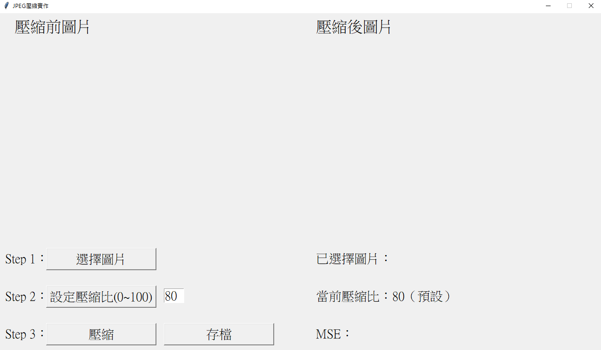
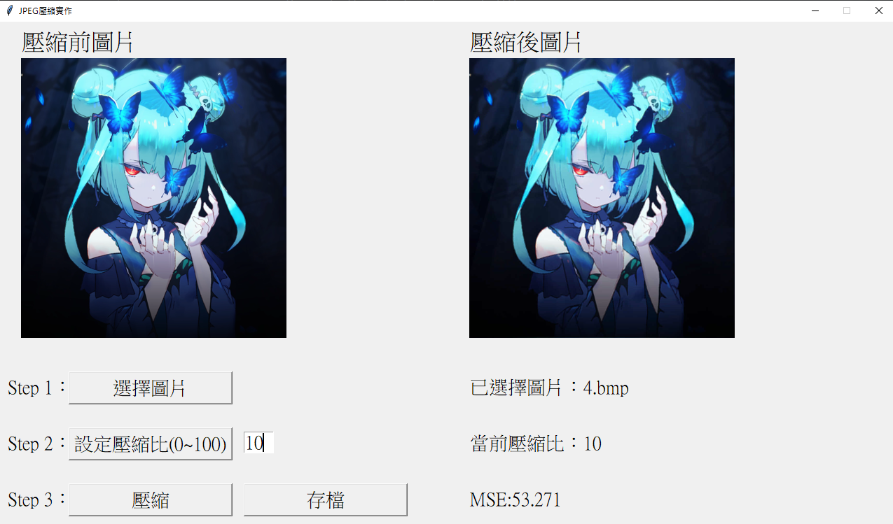
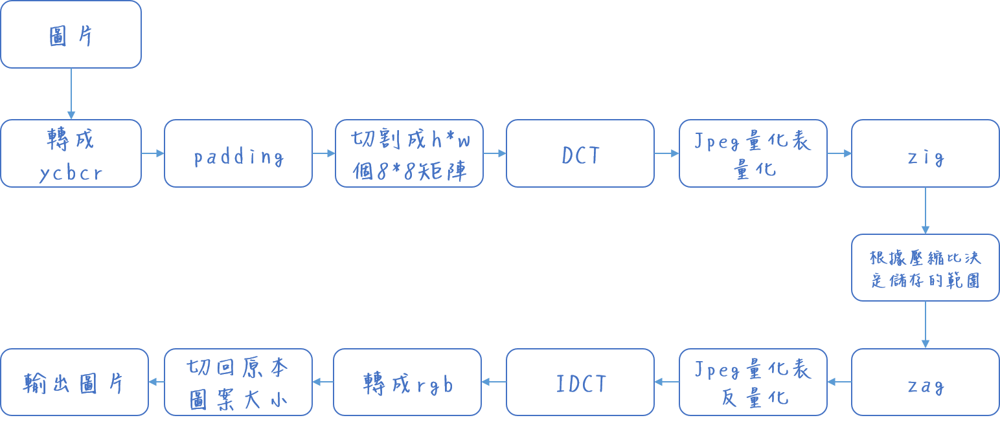

# 資料壓縮期末專題


## 安裝模組

Tkinter, Numpy, Pillow

```python
pip install tk
pip install Pillow
pip install numpy
```


## 程式介面




## 使用方法

１、先點選「選擇圖片」

２、填寫壓縮比後（預設為80）點選「設定壓縮比」

３、點選「壓縮」

４、有需要可以點選「存檔」後將圖片儲存（要填寫副檔名）


## 實際使用




## 程式壓縮流程



